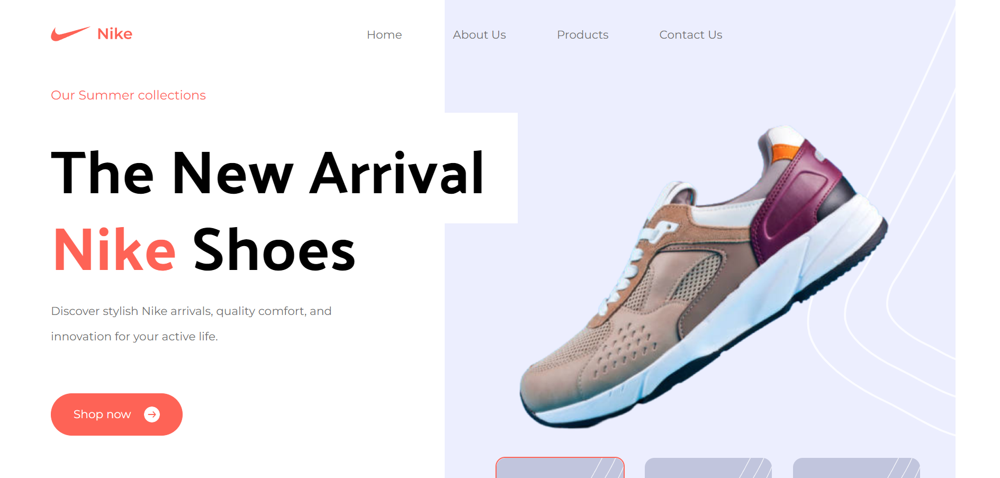

# Nike Landing Page



Welcome to the Nike Landing Page project! This project is a modern and responsive landing page designed to showcase Nike products. It has been developed using Tailwind CSS and React, powered by Vite for a fast development experience.

**Live Demo:** [Nike Landing Page Demo](https://nike-landing-page1.netlify.app/)

## Table of Contents

- [Features](#features)
- [Technologies Used](#technologies-used)
- [Getting Started](#getting-started)
- [Contribution](#contribution)
- [License](#license)

## Features

- Modern and responsive design.
- Showcase of Nike products.
- Interactive elements.
- Easy-to-understand project structure.

## Technologies Used

- [Tailwind CSS](https://tailwindcss.com/): A utility-first CSS framework.
- [React](https://reactjs.org/): A JavaScript library for building user interfaces.
- [Vite](https://vitejs.dev/): A fast development build tool for modern web applications.

## Getting Started

To run this project locally, follow these steps:

1. Clone this repository:

   ```bash
   git clone https://github.com/your-username/nike-landing-page.git
   
2. Navigate to the project directory:

   ```bash
   cd nike-landing-page
3. Install dependencies:
   ```bash
   npm install
4. Start the development server:
   ```bash
   npm run dev
5. Open your web browser and visit http://localhost:5173 to see the project in action.


**Contribution:**
Contributions are welcome! If you'd like to enhance this project or report issues, please open an issue or create a pull request.


License
This project is licensed under the MIT License. See the LICENSE file for details.
